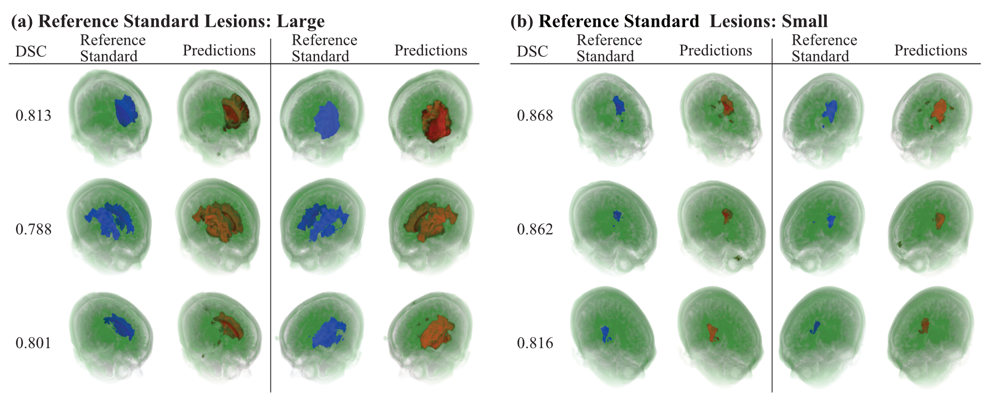
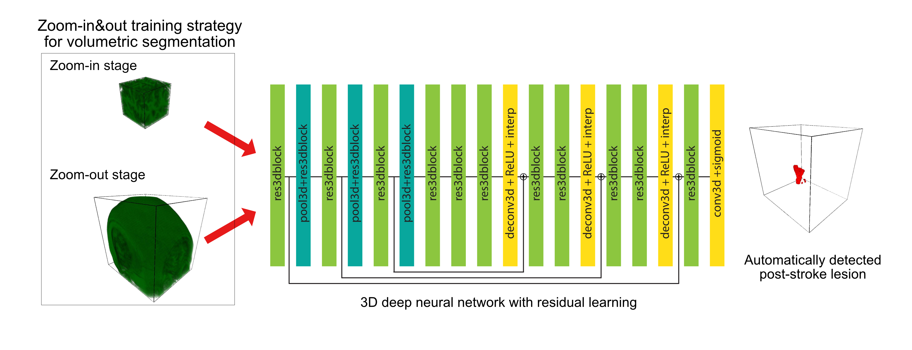
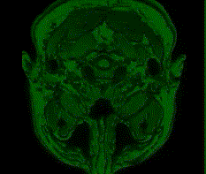
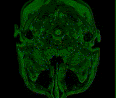

# 3D MRI Segmentation using Zoom-in&out training strategy
This is PyTorch implementation of Deep Residual 3D U-Net for MRI segmentation. 

This is also the source code for *[Automatic post-stroke lesion segmentation on MR images using 3D residual convolutional neural network](https://doi.org/10.1016/j.nicl.2020.102276)*





## Highlights
+ We developed a deep learning model for MRI 3D lesion segmentation of chronic stroke.
+ Our novel zoom-in&out strategy increases performance and accelerates optimization.
+ High performance was achieved in both volumetric and surface-based metrics.



## Zoom-in&out training strategy for efficient volumetric segmentation
We used a two-stage zoom-in&out strategy to first train them on small volumes, and then we finetuned the models on larger volumes. Advantages are:
- Training models with smaller volumes can have a regularizing effect due to performing data augmentation by randomly extracting diverse sub-volumes from original volumes.
- A “zoom-in” step is a computationally inexpensive option and can utilize sub-optimal graphic processing units (GPUs) for the task. By feeding smaller volumes to older but more accessible GPUs, models can be trained in parallel, and, as a result, are faster. 
- The “zoom-out” stage involves showing models larger volumes to learn from the broader context of input images and improves the robustness of the model.

##  The details for the model optimization in our experiments.
<table>
<thead>
  <tr>
    <th>Optimization Stage</th>
    <th>Zoom-In Stage</th>
    <th>Zoom-Out Stage</th>
  </tr>
</thead>
<tbody>
  <tr>
    <td>Input volume size (mm3) </td>
    <td>128 × 128 × 128 (24% sub-volume)  </td>
    <td>144 × 172 × 168 (48% sub-volume)  </td>
  </tr>
  <tr>
    <td>Training Length</td>
    <td>1200 epochs</td>
    <td>150 epochs</td>
  </tr>
  <tr>
    <td>Initial learning rate</td>
    <td>1.00E−03</td>
    <td>1.00E−04 </td>
  </tr>
  <tr>
    <td>Optimizer</td>
    <td colspan="2">Adam optimizer and cosine annealing with warm restart scheduler</td>
  </tr>
  <tr>
    <td>GPU</td>
    <td>Nvidia Titan Xp with 12 GB memory</td>
    <td>Nvidia Titan RTX with 24 GB memory</td>
  </tr>
</tbody>
</table>

##  Effectiveness of zoom-in&out strategy
<table>
<thead>
  <tr>
    <th>Methods</th>
    <th>microDSC</th>
    <th>DSC</th>
    <th>HD (mm)</th>
    <th>ASSD (mm)</th>
    <th>TPR</th>
    <th>Precision</th>
  </tr>
</thead>
<tbody>
  <tr>
    <td>3D-ResU-Net w/o zoom-out</td>
    <td>0.73</td>
    <td>0.60 (0.47–0.73)</td>
    <td>35.1 (20.4–51.3)</td>
    <td>7.6 (3.7–12.3)</td>
    <td><b>0.83 (0.71–0.91)</b></td>
    <td>0.54 (0.39–0.67)</td>
  </tr>
  <tr>
    <td>3D-ResU-Net w/ zoom-in&out</td>
    <td><b>0.79</b></td>
    <td><b>0.64 (0.51–0.76)</b></td>
    <td><b>20.4 (10.0–33.3)</b></td>
    <td><b>3.6 (1.7–6.2)</b></td>
    <td>0.81 (0.68–0.89)</td>
    <td><b>0.62 (0.48–0.74)</b></td>
  </tr>
  <tr>
    <td>Δ</td>
    <td>+0.06</td>
    <td>+0.04</td>
    <td>−14.7</td>
    <td>−4.0</td>
    <td>−0.02</td>
    <td>+0.08</td>
  </tr>
</tbody>
</table>
Best scores are marked in bold.

## Visualization of segmentation results



## Dependencies
- Python 3.6
- [PyTorch 1.3](https://pytorch.org/)
- [NiBabel](https://nipy.org/nibabel/)
- [scikit-image](https://scikit-image.org/)
- [scikit-learn](https://scikit-learn.org/)


## Usage
## Training a 3D segmentation model
- `python train.py --data_dir <path_to_dataset> --save_dir <path_to_snapshots>`

## Applying zoom-in&out strategy
Zoom-in stage
- `python train.py --data_dir <path_to_dataset> --save_dir <path_to_snapshots> -v xi yi zi`
where xi, yi, zi are the size of input volume in the zoom-in stage.

Zoom-out stage
- `python train.py --data_dir <path_to_dataset> --save_dir <path_to_snapshots> -v xo yo zo --resume_model <path_to_a_snapshot>`
where xo, yo, zo are the size of input volume in the zoom-out stage.

## Volume size selection in Zoom-In&Out training strategy
Here are our suggestions for selecting an optimal volume size in Zoom-In&Out training strategy
- Visualizing typical images from the dataset, and then reviewing the spatial distribution of target lesions to estimate the possible effective input volume size for a specific application. (In our study, we observed in early experiments that using volume sizes significantly smaller than those in our final configuration does not achieve a competitive performance. This performance gap may indicate that volumes cropped for training during these experiments were overwhelmed by regions without positive stroke lesions, which could have negatively biased our model optimization in the early experiments.)
- Performing a systematic search on proportions of original volume size (e.g., 25%, 50%, 75% ) to find an optimal configuration.


## Testing a trained model
- `python test.py --data_dir <path_to_dataset> --model_path <path_to_a_snapshot>`


# Citations
3dMRISegmentation is an open-source library and is licensed under the GNU General Public License (v3). 

If you are using this library, please cite:

```Naofumi Tomita, Steven Jiang, Matthew E. Maeder, and Saeed Hassanpour. "Automatic Post-Stroke Lesion Segmentation on MR Images using 3D Residual Convolutional Neural Network." NeuroImage: Clinical (2020): 102276.```
